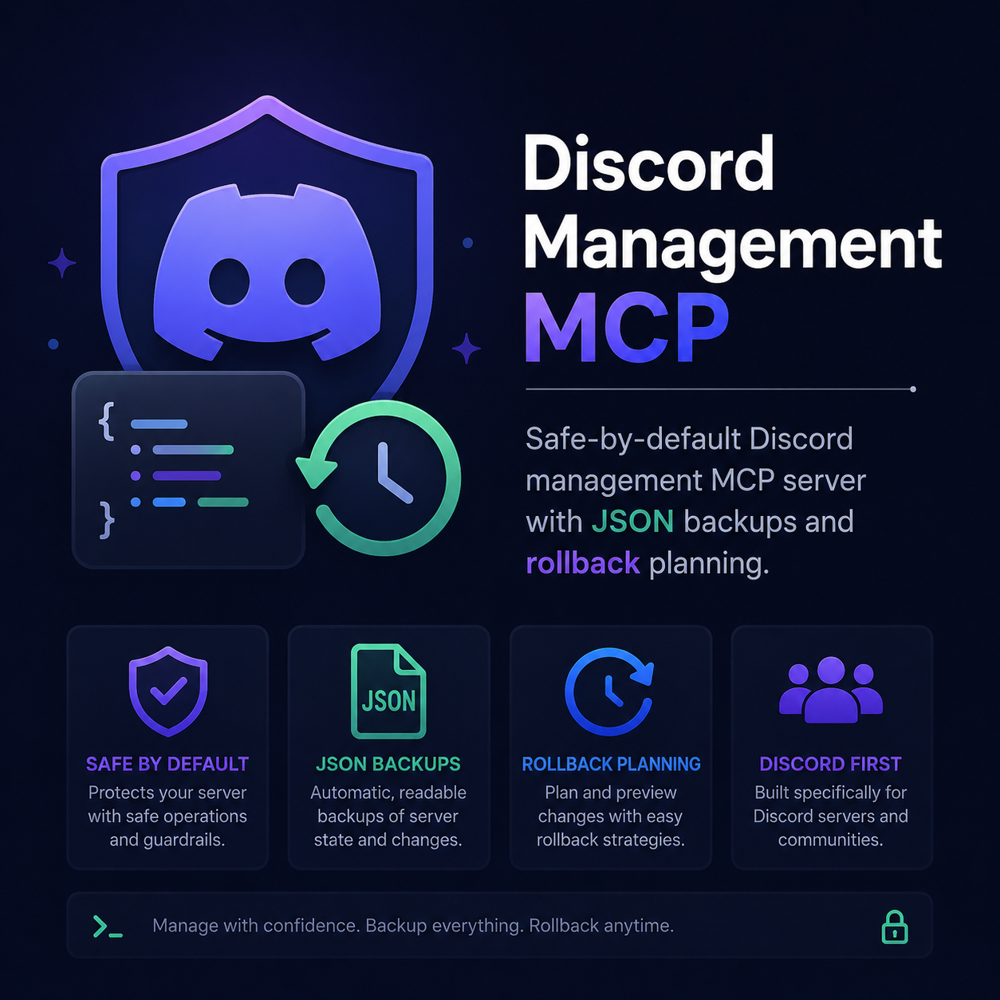

# Discord Management MCP



Safe-by-default Discord management server for the Model Context Protocol (MCP). It lets MCP clients inspect and manage Discord guilds through a local stdio server, with JSON backups, restore planning, and explicit guardrails for risky operations.

Created by [Michael Gasperini](https://mikesoft.it). Repository: [TheStreamCode/discord-management-mcp](https://github.com/TheStreamCode/discord-management-mcp).

## Highlights

- **Local stdio MCP server**: no public HTTP listener, no hosted service, no proxy.
- **Discord-first tooling**: guild, channel, role, member, AutoMod, scheduled event, invite, webhook, emoji, sticker, and application-command tools.
- **Safe mutations**: write operations require `confirm: true` and a non-empty `reason`.
- **Destructive-operation guards**: destructive tools require a valid backup ID or an explicit `allowWithoutBackup: true`.
- **Guild-matched backups**: destructive guards reject backups from a different Discord guild.
- **Readable JSON backups**: snapshots are stored locally and can be diffed or used for conservative restore planning.
- **Conservative restore apply**: role/channel create and update operations only by default; deletes are opt-in.
- **Optional message reading**: `Message Content` is disabled by default and must be explicitly enabled.

## Requirements

- Node.js `>=24`
- A Discord application with a bot token
- The bot invited to the target guild with the permissions required for the tools you plan to use

This project does not require global packages. Install dependencies locally in the project.

## Setup

Create `.env.local` from `.env.example`:

```dotenv
DISCORD_TOKEN=your_bot_token_here
LOG_LEVEL=info
BACKUP_DIR=backups
ENABLE_MESSAGE_CONTENT=false
ENABLE_GUILD_MEMBERS=false
```

Use the token from **Discord Developer Portal > Application > Bot > Token**. Do not use the Application ID or Public Key.

Install, build, and run:

```bash
npm install
npm run build
npm start
```

## Discord Intents

Default gateway intents avoid privileged intents so a new bot can start with minimal setup.

Optional privileged intents:

- `ENABLE_MESSAGE_CONTENT=true`: enables `discord_list_channel_messages`. You must also enable **Message Content Intent** in Discord Developer Portal > Bot > Privileged Gateway Intents.
- `ENABLE_GUILD_MEMBERS=true`: enables stronger member-listing behavior where Discord requires the Guild Members privileged intent.

If these toggles are enabled locally but disabled in the Developer Portal, Discord can reject the login or return empty message fields.

## MCP Client Configuration

Use the built server as a stdio MCP server:

```json
{
  "mcpServers": {
    "discord-management": {
      "command": "node",
      "args": [
        "C:/path/to/discord-management-mcp/dist/index.js"
      ],
      "cwd": "C:/path/to/discord-management-mcp"
    }
  }
}
```

If installed as a package, the binary entry is:

```bash
discord-management-mcp
```

## Safety Model

Read-only tools do not require confirmation.

Mutating tools require:

```json
{
  "confirm": true,
  "reason": "short audit-log reason"
}
```

Destructive tools also require either:

```json
{
  "backupId": "2026-05-29T12-34-56-000Z-123456789012345678.json"
}
```

or:

```json
{
  "allowWithoutBackup": true
}
```

Use `allowWithoutBackup` only when you intentionally accept that rollback may be incomplete.

When a destructive action targets a known guild, the server reads the backup before acting and rejects the request if the backup belongs to a different guild.

## Backup And Restore

Backups are JSON snapshots stored in `backups/`. They include guild metadata, roles, channels, permission overwrites, AutoMod rules, scheduled events, and available metadata for webhooks, invites, emojis, stickers, and application commands.

Recommended workflow:

1. Run `discord_backup_create`.
2. Inspect the guild with read-only tools.
3. Ask your MCP client to produce a plan.
4. Apply changes with `confirm: true`, `reason`, and the backup ID.
5. If needed, use `discord_backup_restore_plan`, then `discord_backup_restore_apply`.

Restore is best-effort. Discord cannot restore original IDs after recreation, message history, audit-log history, invite codes, webhook tokens, managed integration-owned roles, or every community/discovery setting.

`discord_backup_restore_apply` is intentionally conservative: it creates a pre-restore backup automatically, applies role/channel create and update operations, and skips deletes unless `includeDeletes: true` is set.

## Tool Coverage

See [docs/tools.md](./docs/tools.md) for the full tool list.
Configuration details are in [docs/configuration.md](./docs/configuration.md), and the safety model is expanded in [docs/safety-and-backups.md](./docs/safety-and-backups.md).

Main groups:

- Guild inventory and audit tools
- Channel management tools
- Role management tools
- Member moderation tools
- AutoMod and scheduled-event tools
- Invite and webhook tools
- Backup, diff, restore-plan, and restore-apply tools

## Development

```bash
npm run typecheck
npm test
npm run build
npm run check
npm audit --omit=dev
```

The test runner copies source files to a temporary directory before running Vitest. This keeps tests stable even when the repository path contains special characters such as `#`.

## Security Notes

- Never commit `.env.local`, backups, logs, `node_modules/`, or `dist/`.
- The bot token is never printed by the server.
- Webhook URLs are not returned by list/read tools because they contain tokens.
- Backups can contain sensitive server structure and invite metadata; keep them private.
- User tokens and selfbots are not supported.

For release preparation, see [docs/github-publishing.md](./docs/github-publishing.md).

## License

MIT

Copyright (c) 2026 Michael Gasperini.
